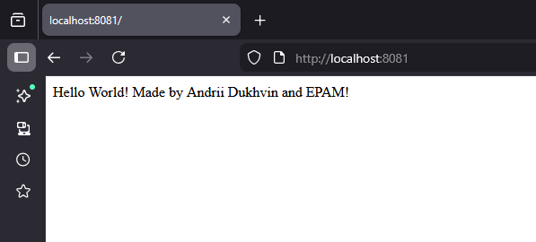
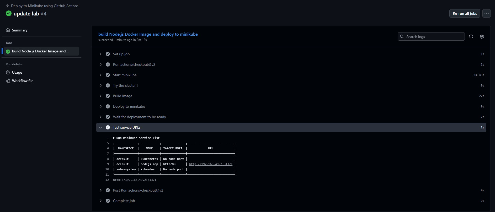

# Continuous Deployment Using GitHub Actions

For local execution, we use the following commands.

## Start Minikube

```
minikube start

kubectl apply -f k8s-node-app.yaml
````

## Login to Docker

```
docker login
```

## Build and Push Image

Next, we build the Docker image and push it to Docker Hub:

```
docker build -t gendalfx/nodejs-app:v1.0.0 .

docker push gendalfx/nodejs-app:v1.0.0
```

## Update Deployment

Then, we change the image in the manifest to ours (`gendalfx/nodejs-app:v1.0.0`) and run:

```
kubectl apply -f k8s-node-app.yaml

kubectl rollout restart deploy/nodejs-app
```

## Verification Options

### Option 1

Get our node IP address:

```
kubectl describe node | grep IP 
```

Get our service port:

```
kubectl get svc
```

Then open `http://IP:PORT` in your browser.

### Option 2

Port forward and access via the host machine browser at [http://localhost:8081/]:

```
kubectl port-forward svc/nodejs-app 8081:80
```

And we see:



And github actions:

